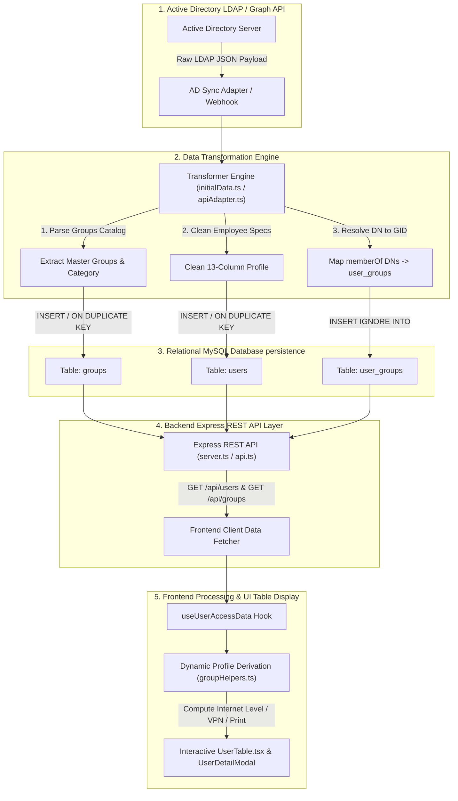

# Active Directory & API Data Pipeline Integration Guide

เอกสารอธิบายกระบวนการทำงานทั้งระบบ (End-to-End Pipeline Workflow) ตั้งแต่การดึงข้อมูลพนักงานและสิทธิ์จาก **Active Directory (LDAP / Graph API)**, การแปลงข้อมูล (Data Transformation Engine), การบันทึกลง **MySQL Database**, ไปจนถึงการให้บริการผ่าน **REST API** และนำมาคำนวณประมวลผลแสดงผลบน **UI Table** ของระบบ User Access Management Dashboard V2

---

## 🏗️ ภาพรวมกระบวนการทำงานทั้งระบบ (Pipeline Architecture Overview)



---

## 📥 ขั้นตอนที่ 1: การดึงข้อมูลจาก Active Directory (AD LDAP Extraction)

เมื่อระบบทำการซิงค์ข้อมูลผ่านคำสั่ง API (`POST /api/sync`) หรือรันสคริปต์อัตโนมัติ ข้อมูลดิบ (Raw Active Directory Object) จะถูกดึงมาจาก LDAP / Active Directory Domain Controller ในรูปแบบ JSON:

```json
{
  "sAMAccountName": "somchai.p",
  "employeeID": "EMP-88001",
  "displayName": "สมชาย ใจดี",
  "userPrincipalName": "somchai.p@company.co.th",
  "department": "Information Technology",
  "title": "Senior IT Specialist",
  "company": "Alpha Group",
  "whenCreated": "2024-01-15T08:00:00.000Z",
  "accountExpires": "2026-12-31T23:59:59.000Z",
  "memberOf": [
    "CN=Internet Level A,OU=Groups,DC=company,DC=local",
    "CN=VPN Access,OU=Groups,DC=company,DC=local",
    "CN=Printer Color,OU=Groups,DC=company,DC=local",
    "CN=IT Department,OU=Groups,DC=company,DC=local"
  ],
  "extensionAttribute1": "DEV-9001",
  "extensionAttribute2": "889001",
  "extensionAttribute3": "Domain Admins",
  "extensionAttribute6": "Microsoft 365 E5"
}
```

---

## ⚙️ ขั้นตอนที่ 2: การแปลงข้อมูล (Data Transformation Engine)

ฟังก์ชัน **`transformAdApiResponseToAppModel()`** ใน [`src/data/initialData.ts`](file:///c:/Users/aapico.intern07/Documents/user_management_dashboard/user_management_dashboard_V2/user_access_management/src/data/initialData.ts#L411-L476) และ **`syncFromActiveDirectory()`** ใน [`src/services/apiAdapter.ts`](file:///c:/Users/aapico.intern07/Documents/user_management_dashboard/user_management_dashboard_V2/user_access_management/src/services/apiAdapter.ts) จะทำหน้าที่แยกข้อมูลออกเป็น 3 ตารางสัมพันธ์ (Relational Triad):

### 2.1 ถอดรหัสกลุ่มสิทธิ์ (Master Group Catalog Normalization)
* อ่านรายการ `cn` และ `distinguishedName` จาก AD
* แมป `group_id` กับตารางหมวดหมู่มาตรฐาน (`category`):
  * `101-103` 👉 `INTERNET_LEVEL`
  * `104-106` 👉 `RESOURCE_ENTITLEMENT`
  * `107` 👉 `NETWORK_VPN`
  * `108-109` 👉 `PRINT_QUOTA`
  * กลุ่มแผนกทั่วไป 👉 `ORGANIZATIONAL`

### 2.2 คลีนข้อมูลพนักงานเป็น 13 คอลัมน์ (Clean User Profile)
* ข้อมูลของพนักงานถูกจัดกลุ่มและตัดคอลัมน์สิทธิ์ซ้ำซ้อนออก เหลือ 13 คอลัมน์สะอาดตรงตามสคีมา:
  ```typescript
  {
    employee_id: u.employeeID,
    username: u.sAMAccountName,
    display_name: u.displayName,
    email: u.userPrincipalName,
    job_title: u.title || '-',
    department: u.department || '-',
    company: u.company || '-',
    device_code: u.extensionAttribute1 || '-',
    authority_group: u.extensionAttribute3 || 'Domain Users',
    creation_date: '2024-01-15',
    expiry_date: '2026-12-31',
    telephone_pass_code: u.extensionAttribute2 || '-',
    o365_license: u.extensionAttribute6 || 'Microsoft 365 E3'
  }
  ```

### 2.3 แปลง Distinguished Names เป็น Junction Map (`user_groups`)
* อ่านค่าในอาร์เรย์ `memberOf` แล้วจับคู่กับ `distinguishedName` ของแต่ละ Group เพื่อสร้างรายการคู่สัมพันธ์ `(employee_id, group_id)`

---

## 💾 ขั้นตอนที่ 3: การบันทึกลงฐานข้อมูล MySQL (Database Persistence)

ระบบ backend ผ่านบริการ **`dataService.syncData()`** ใน [`src/backend/services/dataService.ts`](file:///c:/Users/aapico.intern07/Documents/user_management_dashboard/user_management_dashboard_V2/user_access_management/src/backend/services/dataService.ts#L388-L462) จะทำหน้าที่บันทึกข้อมูลเข้าสู่ฐานข้อมูล MySQL ผ่าน Parameterized SQL Queries:

```sql
-- 1. บันทึก/อัปเดตข้อมูลกลุ่มสิทธิ์
INSERT INTO `groups` (group_id, group_name, description, internet_level, is_special, category, badge_color)
VALUES (?, ?, ?, ?, ?, ?, ?)
ON DUPLICATE KEY UPDATE 
  group_name=VALUES(group_name), description=VALUES(description), category=VALUES(category);

-- 2. บันทึก/อัปเดตข้อมูลพนักงาน (Clean 13 Columns)
INSERT INTO `users` (employee_id, username, display_name, email, job_title, department, company, device_code, authority_group, creation_date, expiry_date, telephone_pass_code, o365_license)
VALUES (?, ?, ?, ?, ?, ?, ?, ?, ?, ?, ?, ?, ?)
ON DUPLICATE KEY UPDATE 
  username=VALUES(username), display_name=VALUES(display_name), email=VALUES(email), job_title=VALUES(job_title), department=VALUES(department), company=VALUES(company);

-- 3. บันทึกความสัมพันธ์การถือครองสิทธิ์ (Junction Table)
INSERT IGNORE INTO `user_groups` (employee_id, group_id) 
VALUES (?, ?);
```

---

## 🔌 ขั้นตอนที่ 4: การให้บริการผ่าน REST API (API Endpoints Layer)

Backend Server (`express` ใน [`src/backend/routes/api.ts`](file:///c:/Users/aapico.intern07/Documents/user_management_dashboard/user_management_dashboard_V2/user_access_management/src/backend/routes/api.ts)) จะอ่านข้อมูลจาก MySQL และให้บริการแก่อยู่บน REST Endpoints:

1. **`GET /api/users`**: ดึงข้อมูลพนักงานทั้งหมด พร้อม JOIN ข้อมูลความสัมพันธ์กลุ่มสิทธิ์จาก `user_groups`
2. **`GET /api/groups`**: ดึงข้อมูลกลุ่มสิทธิ์ทั้งหมด พร้อมป้ายกำกับหมวดหมู่ `category` และ `is_special`
3. **`GET /api/user-groups`**: ดึงข้อมูลคู่จับคู่ความสัมพันธ์ทั้งหมดระหว่าง `employee_id` และ `group_id`

---

## 🖥️ ขั้นตอนที่ 5: การประมวลผลบน Frontend และแสดงผลในตาราง (UI Rendering)

เมื่อ Frontend ดึงข้อมูลผ่าน React Hook **`useUserAccessData`**:

1. **คำนวณสิทธิ์สด (Dynamic Profile Derivation)**:
   ฟังก์ชันใน [`src/utils/groupHelpers.ts`](file:///c:/Users/aapico.intern07/Documents/user_management_dashboard/user_management_dashboard_V2/user_access_management/src/utils/groupHelpers.ts) จะอ่านรายการกลุ่มใน `user.groups` แล้วคำนวณผลสรุปสดทันที:
   * **Internet Level**: ประมวลผลว่าพนักงานได้ Level A, B หรือ C (เรียงความสำคัญ A > B > C)
   * **VPN Status**: ประมวลผลว่าเปิดใช้งาน (Active / True) หรือไม่
   * **Print Quota**: ประมวลผลว่าเป็น ปริ้นสี (Color), ปริ้นขาวดำ (Mono) หรือ Standard
   * **Special Entitlements**: แมปไอคอนแสดงผลแบบการ์ดใน `UserDetailModal`

2. **การแสดงผลในตาราง `UserTable.tsx`**:
   * นำข้อมูลที่ผ่านการประมวลผลมาเรนเดอร์ในตาราง **HTML Table** พร้อมระบบกรอง Hybrid Dual-Mode Filtering (Dropdown Single-Select + Multi-Token Bar), ระบบเรียงลำดับ (Sorting), และระบบแบ่งหน้า (Pagination)

---

## 🎯 สรุปจุดเด่นของระบบการซิงค์ข้อมูล (Key Highlights)

* ✅ **Single Source of Truth**: สิทธิ์ทั้งหมดอ้างอิงจากตารางความสัมพันธ์ `user_groups` ไม่มีการเก็บข้อมูลซ้ำซ้อน
* ✅ **Automatic Data Normalization**: แปลงชื่อกลุ่ม AD หรือ memberOf DNs เป็น Group ID และ Category ที่ถูกต้องโดยอัตโนมัติ
* ✅ **Dynamic UI Calculation**: คำนวณระดับสิทธิ์อินเทอร์เน็ต VPN และเครื่องพิมพ์สดบน Frontend โดยไม่ต้อง Hardcode ลงในฐานข้อมูล
* ✅ **Zero Mock Data Policy**: หากข้อมูลจาก AD ไม่มี หรือเว้นว่างไว้ ระบบจะใส่ค่ามาตรฐานเป็น `"-"` เสมอ เพื่อความถูกต้องตามมาตรฐานองค์กร
