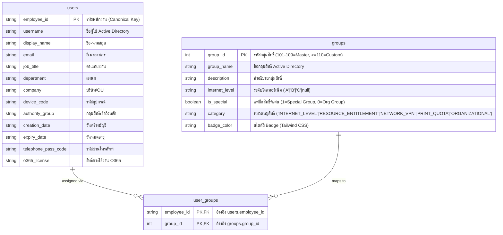

# 📐 System Architecture & Workflow Diagrams (13-Column Clean Schema Engine)

เอกสารนี้รวบรวมแผนภาพไดอะแกรมเชิงสถาปัตยกรรม (Mermaid Diagrams) ของระบบ **User Access Management System (V4 Clean Architecture)** หลังจากการปรับโครงสร้างฐานข้อมูลและ CSV Engine เหลือ 13 คอลัมน์หลักในตาราง `users` โดยผูกสิทธิ์ทั้งหมดรวมถึง Internet Level เข้ากับตาราง **Active Directory Groups (`groups`)** แบบ Clean 3NF Consolidated Schema

---

## 1. 🗄️ โครงสร้างฐานข้อมูลเชิงสัมพันธ์ 3NF (Normalized 3-Table ERD)

คุณสมบัติกลุ่มสิทธิ์ทั้งหมด (รวมถึงสิทธิ์พิเศษ `is_special` และหมวดหมู่ `category`) ถูกจัดเก็บและรวบรวมไว้ในตารางเดียวคือ `` `groups` `` เพื่อความเป็นระเบียบและเป็นไปตามหลัก Single Source of Truth:



---

## 2. ⚡ Dynamic AD Group Computation Engine

```mermaid
flowchart TD
    A[ Active Directory Groups Column ใน CSV / UI ] --> B{ ⚙️ Group Mapper Engine }
    
    B -->|สกัด "Internet Level A/B/C"| C[ 🌐 Internet Level Badge: Level A / B / C ]
    B -->|สกัด "VPN Access"| D[ 🔒 VPN Status Badge: Active / Disabled ]
    B -->|สกัด "Printer Color / Mono"| E[ 🖨️ Print Quota Badge: Printer Color / Mono ]
    B -->|สกัด "Video Access / Communications / Free E-mail"| F[ 🏷️ Resource Badges: Video, Comms, Mail ]

    C --> G[ Table View Render Clean & WOW UI ]
    D --> G
    E --> G
    F --> G
```

---

## 3. 📄 14-Column CSV Header Structure

1. `Employee ID (รหัสพนักงาน)`
2. `Username (ชื่อผู้ใช้)`
3. `Display Name (ชื่อ-นามสกุล)`
4. `Email (อีเมล)`
5. `O365 License (สิทธิ์การใช้งาน O365)`
6. `Job Title (ตำแหน่งงาน)`
7. `Department (แผนก)`
8. `Company (บริษัท)`
9. `Authority Group (กลุ่มสิทธิ์เข้าถึง)`
10. `Device Code (รหัสอุปกรณ์)`
11. **`Groups (กลุ่มสิทธิ์/บทบาท)`** *(Active Directory Groups master field)*
12. `Creation Date (วันสร้างบัญชี)`
13. `Expiry Date (วันหมดอายุ)`
14. `Telephone Passcode (รหัสผ่านโทรศัพท์)`
